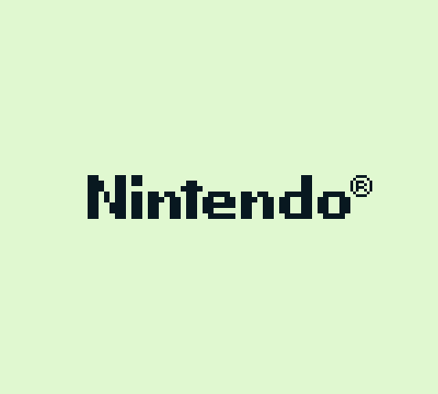
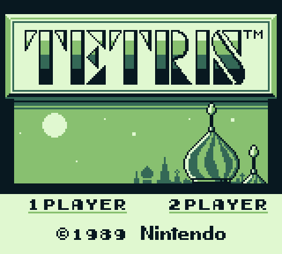
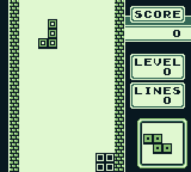

**This is a work in progress.**
# sGBE

sGBE is a Small GameBoy Emulator. 
This project emulates an 8-bit CPU using C++/SDL.

*As of 2023/12/05, it misses 5 instructions and has some graphis issues when playing Tetris. It might not work with other games. Most of Blargg's CPU test do pass!*

  

## Getting started

1. Setup the build environment :
```bash
git clone git@github.com:jprissi/sGBE.git && cd sgbe
mkdir build && cd build
cmake ..
```

2. Build and run the emulator :
```bash
make && ./bin/gbe
```

## Motivations & Features

The goal of this project is to provide a straightforward implementation for an 8-bit CPU. It should be able to run at least a few titles.
It does not aim for cycle-perfect accuracy or extensive support of the GB game library.

## Missing features

- Bank Switching
- Sound
- CGB mode
- ...

## Acknowledgements

- **lmmendes** for the [opcodes .json file](https://github.com/lmmendes/game-boy-opcodes)
- **robert** for the helpful [Gameboy Doctor debugging tool](https://github.com/robert/gameboy-doctor)

## Contributing

All contributions are welcome!

## Resources

Compare implementation with disassembled source :
https://github.com/osnr/tetris/blob/master/tetris.asm

PPU implementation detailed write-ups:
https://blog.tigris.fr/2019/09/15/writing-an-emulator-the-first-pixel/
https://hacktix.github.io/GBEDG/ppu/

https://robertovaccari.com/blog/2020_09_26_gameboy/
