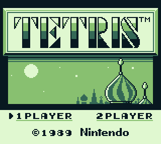

# sGBE

sGBE is a Small GameBoy Emulator. 
This project emulates an 8-bit CPU using C++/SDL.

**This is still a work in progress.**

*As of 2023/12/01, it still misses 5 instructions and does not display object sprites*

 

## Getting started

Setup build environment :
```bash
git clone <repo> && cd sgbe
mkdir build && cd build
cmake ..
```

Build and run the emulator :
```bash
make && ./bin/gbe
```

## Acknowledgements

- **lmmendes** for the [opcodes .json file](https://github.com/lmmendes/game-boy-opcodes)
- **robert** for the helpful [Gameboy Doctor debugging tool](https://github.com/robert/gameboy-doctor)

## Resources

Compare implementation with disassembled source :
https://github.com/osnr/tetris/blob/master/tetris.asm

PPU implementation detailed write-ups:
https://blog.tigris.fr/2019/09/15/writing-an-emulator-the-first-pixel/
https://hacktix.github.io/GBEDG/ppu/

https://robertovaccari.com/blog/2020_09_26_gameboy/
